# Finishing Pasta Cooking in the Sauce (Mantecatura)

**Date:** 2026-01-05

Today I discovered why pasta at Italian restaurants tastes so incredible! Thanks to my Zio, the best Italian cook for teaching me this technique 💜

The secret? **Stop cooking 2-3 minutes before** the time indicated on the package, and finish in the sauce. This technique is called *mantecatura*.

## How to do it

It's simple and it changes everything:

1. **Keep a cup of pasta water** before draining (it's liquid gold!)
2. Transfer the still-firm pasta into the pan with the hot sauce
3. Add some pasta water
4. Stir vigorously for 2 minutes over medium heat

```mermaid
graph TB
    A[🍝 Pasta in boiling water] -->|"⏰ Stop 2-3 min before"| B[Al dente- pasta]
    B --> C[💧 Keep 1 cup pasta water]
    C --> D[🍳 Transfer to pan with hot sauce]
    D --> E[Add pasta water]
    E --> F[🔥 Stir vigorously 2 min]
    F --> G[✨ Magic: Starch + Sauce = Creamy]
    G --> H[🍽️ Perfect pasta!]

    style A fill:#e1f5ff
    style G fill:#fff4e1
    style H fill:#e8f5e9
```

The magic? The starch from the pasta mixes with the sauce and creates that perfect creamy texture, without cream! The pasta absorbs the flavors instead of just salted water.

## My advice

For oil-based or cheese sauces, remove from heat for the last minute of mixing. This prevents the fat from separating.

It's so good that I can't wait to make it again tonight! 🍝
